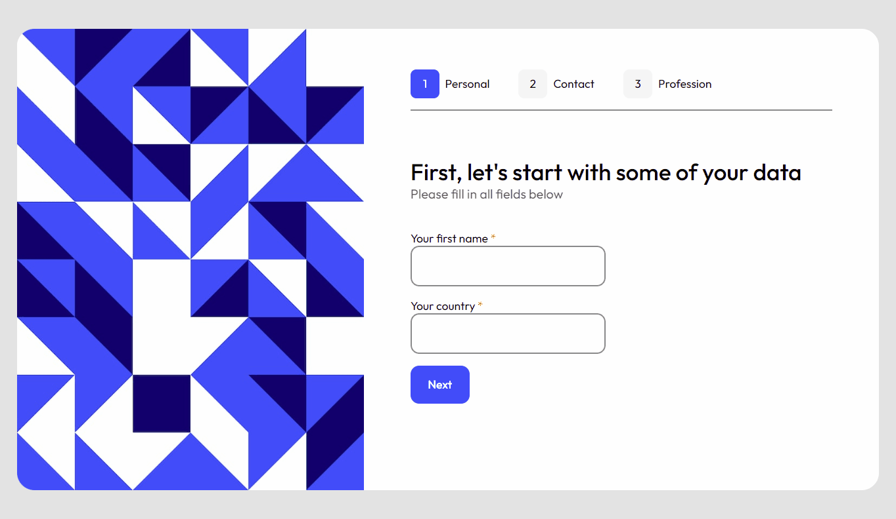

    <h2>⚜️ M U L T I - S T E P &nbsp; F O R M ⚜️</h2>

    <a href="#-project">Project</a>&nbsp;&nbsp;&nbsp;|&nbsp;&nbsp;&nbsp;
    <a href="#-technologies">Technologies</a>&nbsp;&nbsp;&nbsp;|&nbsp;&nbsp;&nbsp;
    <a href="#-features">Features</a>

 

<h3 align="center">
    
     
    <a href="https://erickks.github.io/multi-step-form-react/">live demo</a>
</h3>

 

## 📚 Project

This basic form is planned to obtain user data and show them at the end.

It also validates the values inserted by the user, avoiding going to the next step with incorrect data.

 

## 🖥 Technologies
  * [React](https://reactjs.org/)
  * [TypeScript](https://www.typescriptlang.org/)
  * [React Router](https://reactrouter.com/en/main)
  * [Styled Components](https://styled-components.com/)

 

## 🧾 Features
- [x] Input validation
- [x] Get input field value
- [x] You can edit your data
- [x] If validation is done and something is wrong, you'll be stopped from proceeding to the next step
- [x] Responsive
